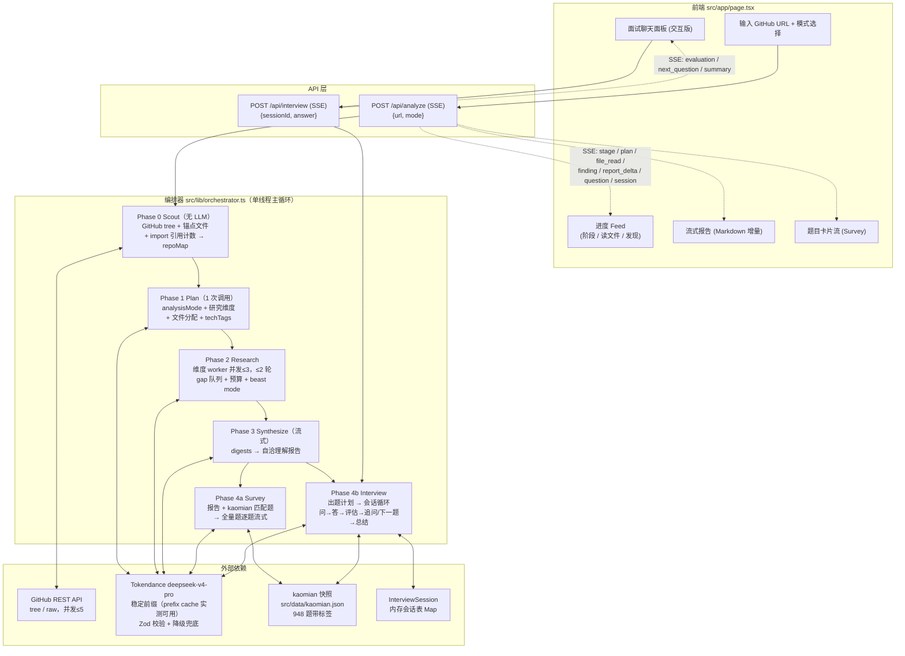

# 系统架构：Repo Deep Research Agent

输入公开 GitHub 仓库后，系统以"单编排线程 + 受控并行 digest worker + 单次合成"的方式深度理解仓库，再结合 kaomian 高频题库生成面试题。支持两种模式：

- **Survey 版**：一次读懂整个项目，流式输出理解报告和全量面试题。
- **交互版**：模拟真实面试，一问一答，按回答质量决定追问或推进，结束后给总结反馈。

架构决策依据见 `docs/research/deep-research-agent-design.md`（核心结论：仓库是有界输入，不做自由 agent swarm；并行只用于只读分析，写作单次合成保证自洽；不用 embedding，agentic 按需读取）。

## 总体架构

## 阶段说明

| 阶段 | LLM 调用 | 输入 | 输出 | 关键约束 |
|---|---|---|---|---|
| Phase 0 Scout | 0 | repo URL | repoMap（文件树骨架 + 锚点 + 中心度排序，1-4k token） | 纯确定性；锚点 = README/configs/入口 |
| Phase 1 Plan | 1 | repoMap + README | 研究维度、文件分配、techTags、analysisMode | Zod 校验；维度按仓库形态动态取舍 |
| Phase 2 Research | ≤10 | 每维度：repoMap + 分配文件全文（超限骨架化） | DimensionDigest（findings/claimCodeLinks/askPoints/openQuestions） | 原文不进主线程；digest ≤300 token/条；预算耗尽 → beast mode |
| Phase 3 Synthesize | 1 | 全部 digests + repoMap | 理解报告（流式 Markdown） | 单次合成保证自洽 |
| Phase 4a Survey | 1 | 报告 + kaomian 匹配题 | 全量面试题（逐题流式） | 主追问链必须绑仓库证据；八股标注来源 |
| Phase 4b Interview | 每轮 1 | 会话状态 + 用户回答 | 评估（1-5 分 + 反馈）+ 追问/下一题/总结 | 弱回答追问、强回答推进（DevContext.AI 模式） |

## 上下文管理硬规则

1. 原始文件内容只进 worker context；主线程只持有 repoMap + digests（≤20k token）。
2. 单文件 >6k token 先骨架化（保留签名/docstring/import）；单 worker 输入预算 ~40k token。
3. 单次分析 LLM 调用 ≤13 次。
4. 所有调用共享稳定 system 前缀：无时间戳、append-only、JSON key 顺序固定（实测 Tokendance 支持 prefix caching，cache hit 直接降本提速）。
5. 每条 finding/question 必须带 evidence 文件路径，缺失由 `ensureEvidence` 回填。
6. worker Zod 校验失败重试 1 次后跳过该维度；全局兜底走降级报告路径。

## 已知取舍

- 交互版会话存进程内存，重启丢失（demo 取舍，未来换持久化存储）。
- kaomian 按 ADR-0002 以快照消费，关键词/标签检索，不做 embedding。
- 文件骨架化用正则而非 tree-sitter（24h 预算取舍，效果覆盖主要语言的签名提取）。
