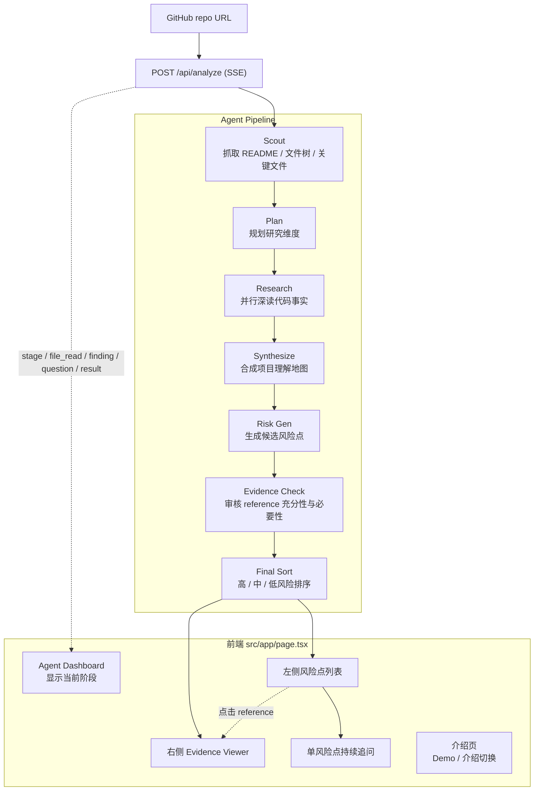

# 系统架构：Traceback Repo 面试风险审查器

Traceback 输入公开 GitHub 仓库，先用 Repo Deep Research Agent 读懂项目，再生成“会被面试官问穿”的风险点。每个风险点进入最终结果前，都要经过 Evidence Check Agent 审核 reference 是否充分且必要。最终前端以双栏 viewer 展示：左侧问题，右侧代码 / README / 配置证据。

## 总体流程



## API

| API | 作用 |
|---|---|
| `POST /api/analyze` | SSE 分析入口，输入 repo URL，输出风险点、证据 bundle 和进度事件。 |
| `POST /api/risk-chat` | 单风险点持续追问，输入 risk、answer、history 和 evidenceRefs。 |

旧的 `question-set`、`interview`、`practice-help` API 仍可保留为兼容层，但不再是当前产品主入口。

## Pipeline 阶段

| 阶段 | LLM 调用 | 输出 | 关键约束 |
|---|---:|---|---|
| Scout | 0 | repo metadata、README、文件树、关键文件 | 纯确定性；过滤大文件、二进制、依赖目录。 |
| Plan | 1 | 研究维度、文件分配、analysisMode、techTags | 只从已读取文件中选择路径。 |
| Research | 1-10 | DimensionDigest：findings、claimCodeLinks、askPoints、openQuestions | 受控并行；必要时补读文件；每条 finding 必须有 evidence。 |
| Synthesize | 1 | Understanding + paperCodeMap | 合成项目 claim、核心实现、数据流、评测与复现路线。 |
| Risk Gen | 1 | 10-20 个候选 examPoint / question | 只出设计思路、具体实现、失败边界和取舍追问。 |
| Evidence Check | 本地规则 + 可扩展模型审核 | `RepoInterviewRisk[]` + `EvidenceCheck` | 不充分或不必要 evidence 会被修剪、重写或丢弃。 |
| Final Sort | 0 | 按 high / medium / low 排序的最终风险点 | 目标 8 个及以上；证据不足时不硬凑。 |

## 核心类型

### `RepoInterviewRisk`

```ts
type RepoInterviewRisk = {
  id: string;
  riskLevel: "low" | "medium" | "high";
  title: string;
  interviewerQuestion: string;
  claim: string;
  whyThisMatters: string;
  evidenceRefs: EvidenceRef[];
  knowledgeGaps: string[];
  referenceAnswer: string;
  redFlags: string[];
  fixSuggestions: string[];
  followUpSeeds: string[];
  source: "repo" | "interview_story";
  evidenceCheck: EvidenceCheck;
};
```

### `EvidenceCheck`

```ts
type EvidenceCheck = {
  status: "pass" | "needs_revision" | "drop";
  sufficiency: "sufficient" | "partial" | "insufficient";
  necessity: "necessary" | "excessive" | "irrelevant";
  missingEvidence: string[];
  removedEvidenceRefs: EvidenceRef[];
  reason: string;
};
```

## Evidence Check 规则

通过标准：

- reference 能证明问题里的代码事实。
- reference 能支撑对应 claim、参考答案和红旗回答。
- 至少覆盖核心实现或配置；必要时覆盖 README claim、eval、train、data。
- 每条 reference 都对判断该风险点有贡献。

不通过标准：

- 只有 README，不能证明具体实现。
- 只有文件名或宽泛模块，不能定位到关键逻辑。
- 只因关键词命中而引用，不支撑问题。
- 问题声称了代码没有证明的实现细节。
- 外部生态比较成为主问题，例如“为什么不用 HuggingFace / vLLM / transformers”，但没有内部实现约束证据。

处理策略：

- `pass`：进入最终结果。
- `needs_revision`：尝试补 evidence 或重写风险点。
- `drop`：不进入最终结果。

## 前端结构

首页有两个视图：

- `Demo`：真实风险审查器。
- `介绍`：用于 3 分钟演讲的一页项目介绍。

Demo 视图：

- `AgentDashboard`：显示当前 agent pipeline 阶段。
- `riskColumn`：风险点列表、折叠详情、回答框。
- `EvidencePane`：证据文件、行号、snippet、reference 切换。
- `RiskDetail`：对应 claim、参考答案、红旗回答、补坑建议、Evidence Check 按钮式折叠区。

## 模型配置

演示优先使用快速配置：

```env
OPENAI_MODEL=deepseek-v4-flash
TOKENDANCE_MODEL=deepseek-v4-flash
TOKENDANCE_RESEARCH_MODEL=deepseek-v4-flash
TOKENDANCE_THINKING_TYPE=disabled
```

如果设置了 `OPENAI_MODEL`，当前实现会让所有阶段都使用该模型。

## 已知取舍

- 右侧 evidence viewer 第一版展示分析时打包的 snippets，不做完整 IDE。
- `kaomian` 只作为真实面经问题素材，不作为泛八股题库。
- 不做整场评分和复盘，避免主线从“证据风险审查”漂移到“模拟考试平台”。
- 分析 run 仍以单进程内存为主；演示场景建议增加固定 demo 快照，避免等待完整 pipeline。
